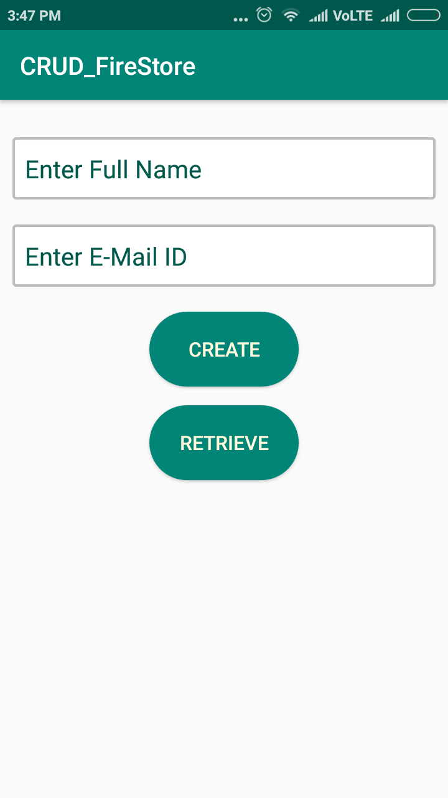
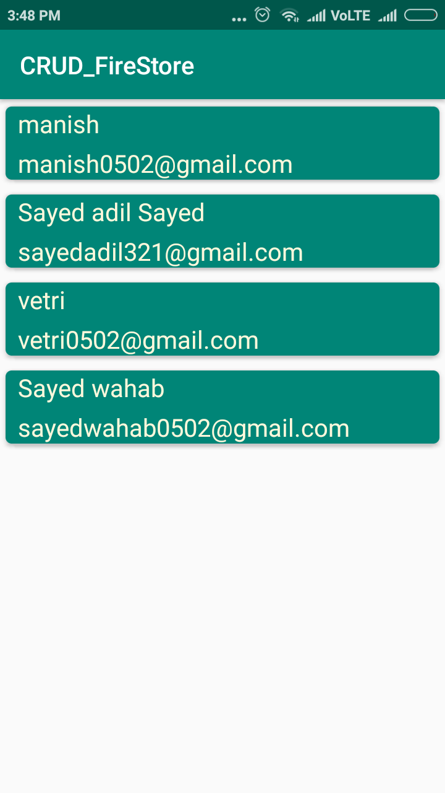
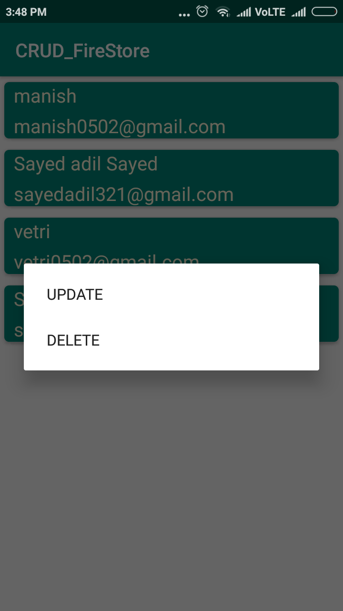
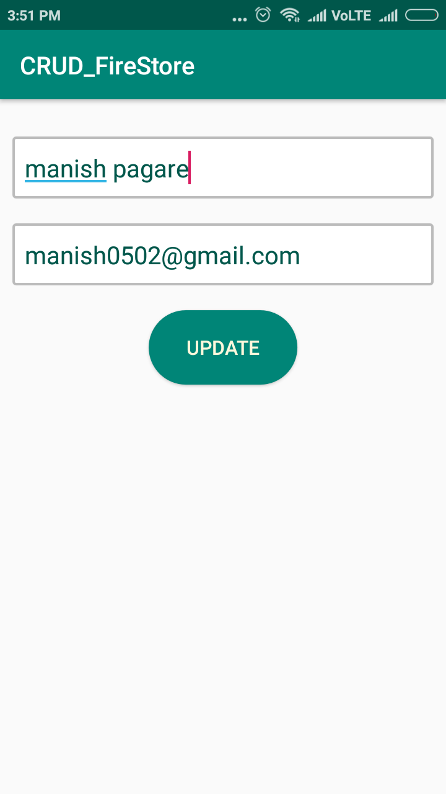
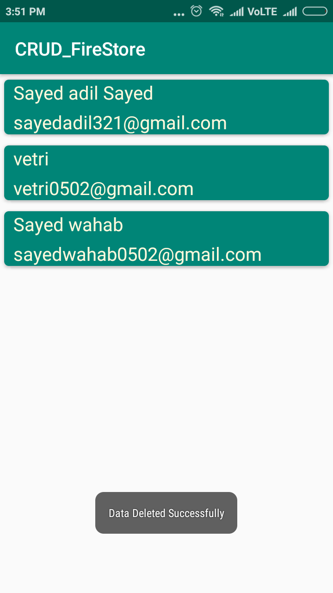
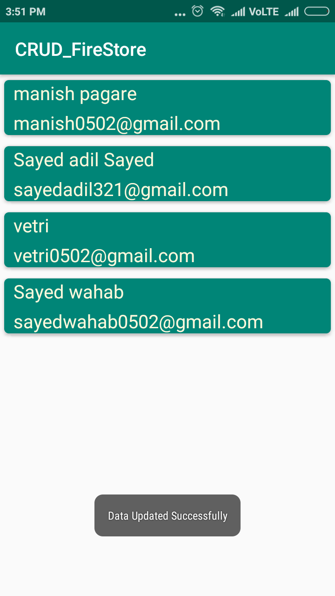

# CRUD_FireStore

This is a Simple to-do Android App intended to perform CRUD Operation using the FireStore Database.

Basically this app contain 3 activities i.e(MainActivity, Main2Activity, Update_Data) and 3 Java Class i.e(CustomAdapter.java, Model.java, ViewHolder.java) and 1 Layout resource file i.e(model_layout.xml)

<h1>Screenshots of the Application</h1>

 

 

  

